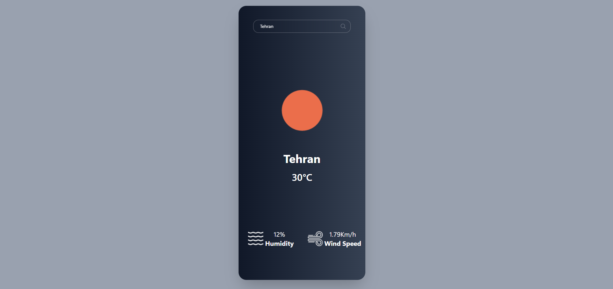

  <h1>🌤️ برنامهٔ نمایش وضعیت آب‌وهوا</h1>
  
  

    
    
    
  

---

## ✨ قابلیت‌های کلیدی / Key Features

🔍 **جستجوی شهر** / Search for any city worldwide  
💧 **سنجش رطوبت** / Humidity measurement  
🌬️ **اطلاعات باد** / Wind speed & direction  
🎨 **آیکون‌های پویا** / Dynamic weather icons (Sunny, Cloudy, Rainy, etc.)  
📱 **طراحی پاسخگو** / Fully responsive for mobile & desktop  
🌡️ **نمایش دما** / Temperature display with Feels Like  

---

## 📸 پیش‌نمایش / Preview

  

---

## 🛠️ فناوری‌های به‌کاررفته / Technologies

⚛️ **React 18** - کتابخانه اصلی / Core library  
🎨 **TailwindCSS** - استایل‌دهی / Styling  
🌤️ **OpenWeather API** - دریافت داده‌های هواشناسی / Weather data provider  
📦 **JavaScript (ES6+)** - منطق برنامه / Application logic